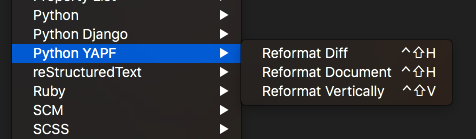

# Python-YAPF.tmbundle
[TextMate 2](https://github.com/textmate/textmate) bundle for the [YAPF Python formatter](https://github.com/google/yapf).

## Prerequisites

First install YAPF if you haven't already. The bundle does not include it. So

	pip install yapf

in your terminal.

Make sure `TM_PYTHON` is set as needed in TextMate > Preferences > Variables.

## Install

### By Downloading

 1. Click Clone or Download > Download Zip
 2. Unzip the file
 3. Rename the folder `Python-YAPF.tmbundle-master` to `Python-YAPF.tmbundle`
 4. Double-click the resulting bundle and choose Install when TextMate asks

### By Cloning

In your terminal of choice:
 
 1. `cd ~/Library/Application\ Support/TextMate/Bundles`
 2. `git clone https://github.com/tiktuk/Python-YAPF.tmbundle.git`
 3. Restart TextMate

## Usage

In Python source, press ^⇧H / ^⇧V or use the menu or any of TextMate's other ways of invoking bundle commands:

 - Reformat Diff opens a new document with proposed changes shown as a diff
 - Reformat Document / Selection executes YAPF normally
 - Reformat Vertically formats the selection as vertically as possible (with `COLUMN_WIDTH` = 1)

The latter was my original motivation for writing this bundle. I got tired of manually formatting

	a = [item1, item2, item3, item4, item5, item6]

into

	a = [
		item1,
		item2,
		item3,
		item4,
		item5,
		item6
	]

Notice that depending on how much whitespace you include in your selection, YAPF may format your code a bit differently.

And select in a way so that the resulting input is valid python. The bundle handles the common case of selecting a range of lines all with the same leading whitespace for you.

## To Do

- [x] Handle IndentationError exception when possible
- [x] Enable formatting selected lines only
- [ ] Enable usage of style settings in config file(s)
